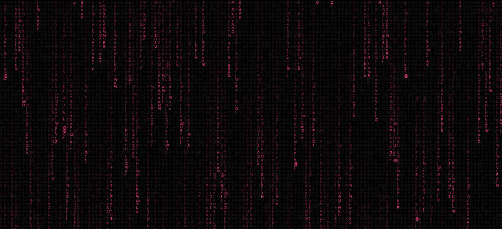
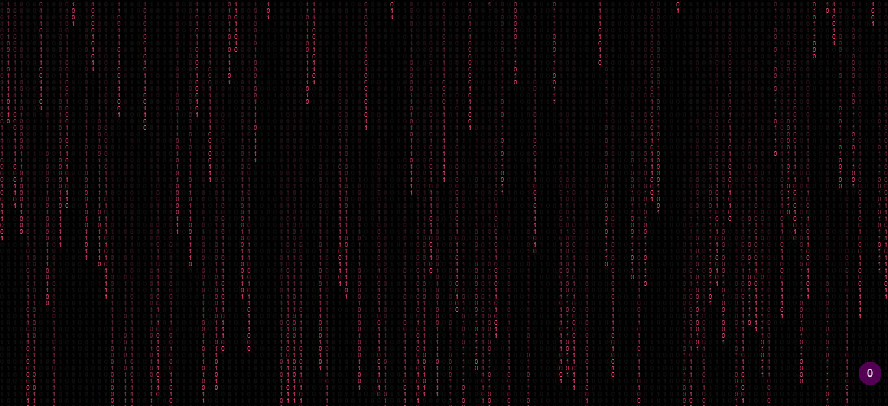
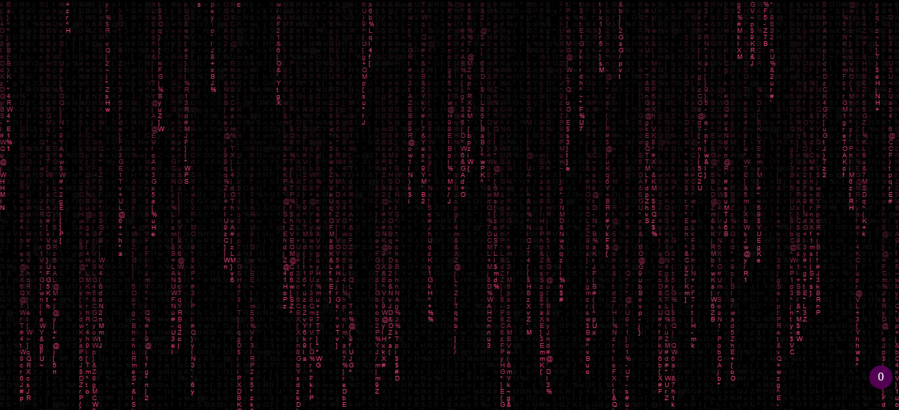
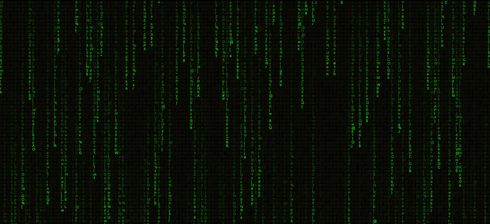

# Matrix Effect




This is a Simple matrix Toturial. i hope it useful.

### Write With:
  

### Changing Theme
>You can change it from " ABCD " to " 01101010101 " :

* ABCD:
* ```var matrix = "abcdefghijklmnopqrstuvwxyzABCDEFGHIJKLMNOPQRSTUVWXYZ123456789@#$%^&*()*&^%+-/~{[|`]}";```

* 01101010101:
* ```var matrix = "101011101010110001010101011011101111010101010110101101010101101011011010101010110100111";```


>And Change Color :

* Pink :

* ```ctx.fillStyle = "#f4427d";//Pink text``` Script.js -> Line:32



* Green :
* ```ctx.fillStyle = "#14f606";//green text``` Script.js -> Line:32



* Or any color you like

#### included Files in Project:
* index.html
* style.css
* script.js